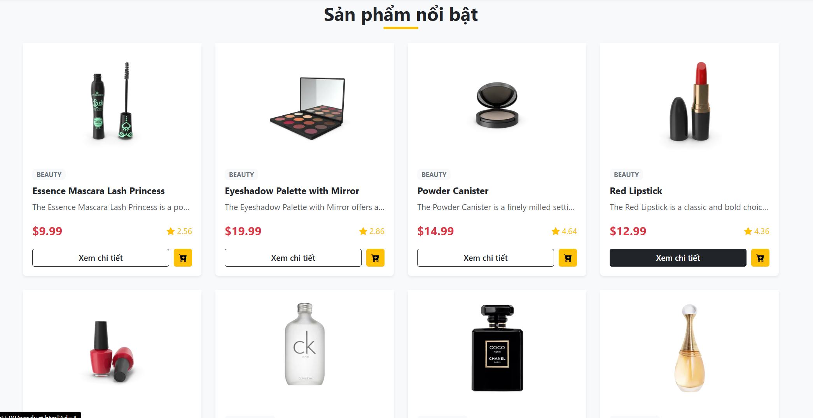
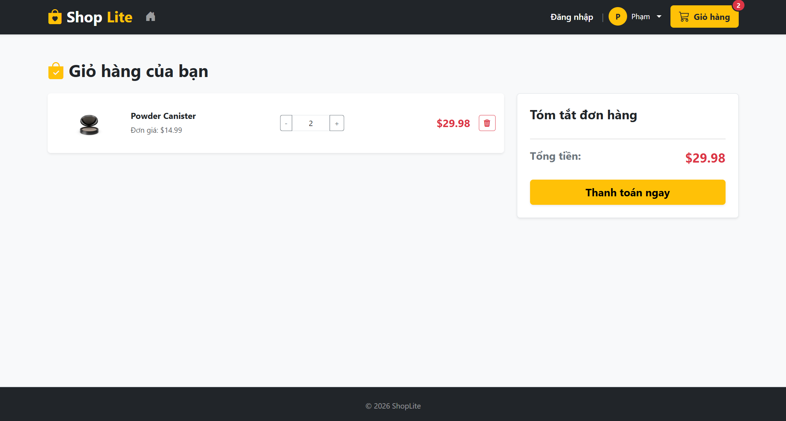
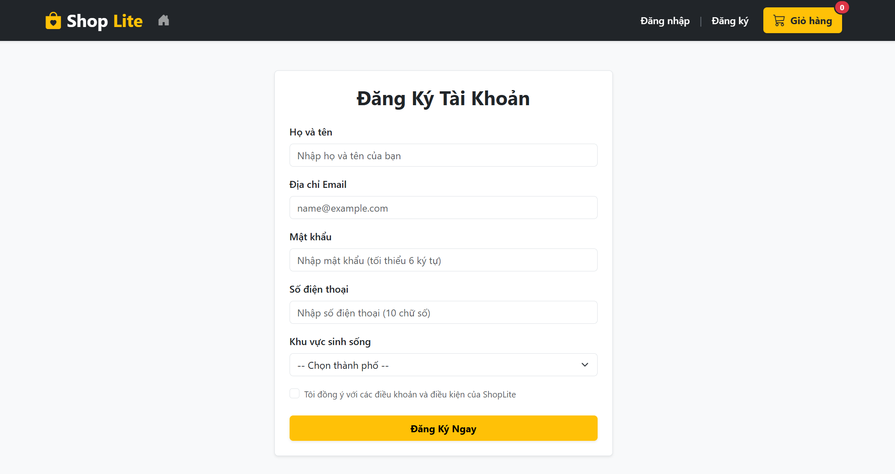

### Mô tả: 
ShopLite là một ứng dụng website bán hàng mini chạy hoàn toàn ở phía Client (Front-end). Dữ liệu sản phẩm sẽ được lấy về từ một API công khai. Dự án được xây dựng nhằm tối ưu hóa trải nghiệm mua sắm, đồng bộ giao diện và áp dụng các kỹ năng xử lý DOM, sự kiện (Event) cùng lưu trữ cục bộ (LocalStorage).

Link github: https://github.com/phamhongle412004-bit/FEF_ASSIGNMENTS_LePH1

### Ảnh chụp giao diện dự án

* **Trang chủ:**



* **Chi tiết sản phẩm:**
.png)

* **Giỏ hàng:**


* **Đăng ký:**



### Cấu trúc thư mục dự án
```
FEF_ASSIGNMENTS_LEPH1/
├── index.html        
├── product.html     
├── cart.html     
├── register.html     
├── css/
│   └── style.css
├── js/
│   ├── api.js         
│   ├── cart.js         
│   ├── home.js
│   ├── product.js
│   └── register.js
├── assets/             # images
└── README.md
```

### Danh sách các tính năng đã hoàn thành
## 1. Phân hạng ĐẠT (Pass tier — Tối đa 6.0 điểm)
- **Kết nối 4 trang (1.0đ):** Có đủ 4 trang (`index.html`, `product.html`, `cart.html`, `register.html`) liên kết đồng bộ qua thanh Navbar chung.
- **Semantic HTML (1.0đ):** Cấu trúc trang chuẩn hóa với các thẻ `<nav>`, `<main>`, `<section>`, `<footer>`, hạn chế lạm dụng `<div>`.
- **Render Trang chủ bằng DOM (1.5đ):** Fetch dữ liệu động từ API và tự động render lưới sản phẩm, không dùng dữ liệu cứng.
- **Trang chi tiết chuẩn ID (1.0đ):** Đọc tham số `?id=...` từ URL để fetch và hiển thị chính xác thông tin sản phẩm tương ứng.
- **Kiểm tra dữ liệu Form (1.0đ):** Sử dụng JavaScript thuần để kiểm tra dữ liệu đầu vào (bắt buộc nhập, định dạng email hợp lệ).
- **Responsive cơ bản (0.5đ):** Giao diện hiển thị tốt, không bị vỡ bố cục trên màn hình thiết bị di động (≤576px).

## 2. Phân hạng KHÁ (Good tier — Tối đa 2.0 điểm)
- **Giỏ hàng LocalStorage (1.0đ):** Tính năng thêm/xóa/sửa số lượng, tính tổng tiền tự động và lưu trữ trạng thái xuyên suốt các trang.
- **Tìm kiếm & Lọc danh mục (0.5đ):** Tìm kiếm theo tên kết hợp lọc theo danh mục, lưới sản phẩm cập nhật lập tức sau khi lọc.
- **Trạng thái Loading & Error (0.3đ):** Có Spinner xoay khi đợi tải dữ liệu và hiển thị hộp thoại báo lỗi trực quan nếu fetch thất bại.
- **Bố cục CSS Flexbox/Grid chuyên sâu (0.2đ):** Tự viết tay CSS Flexbox/Grid giúp giao diện co giãn mượt mà trên cả 3 mốc màn hình.

## 3. Phân hạng XUẤT SẮC (Excellent tier — Tối đa 2.0 điểm)
- **Đồng bộ Badge giỏ hàng (0.3đ):** Số lượng vật phẩm trên icon giỏ hàng ở Navbar tự động cập nhật và đồng bộ thời gian thực ở mọi trang.
- **Trải nghiệm người dùng cao cấp (0.2đ):** Tích hợp Modal đăng nhập ẩn tiện lợi trên Navbar; bổ sung hiệu ứng hover mượt mà và đổ bóng cho thẻ sản phẩm.
- **Mã nguồn chất lượng cao (0.2đ):** Tách biệt các file JS riêng lẻ, đặt tên hàm/biến rõ ràng theo chuẩn, không có lỗi ở Console, có file `README.md` hướng dẫn chi tiết.

### Hướng dẫn chạy dự án tại máy cục bộ 
## 1. Tải mã nguồn về máy:
git clone [https://github.com/phamhongle412004-bit/FEF_ASSIGNMENTS_LePH1.git](https://github.com/phamhongle412004-bit/FEF_ASSIGNMENTS_LePH1.git)

## 2. Di chuyển vào thư mục dự án
  cd FEF_ASSIGNMENTS_LePH1

## 3. Khởi chạy:
- Kích chuột vào file index.html chọn chọn 'Open with Live Server' trên VSCode để chạy dự án cới môi trường local chuẩn nhất.
- Hoặc có thể bấm đúp trực tiếp vào file index.html để mở bằng trình duyệt web.