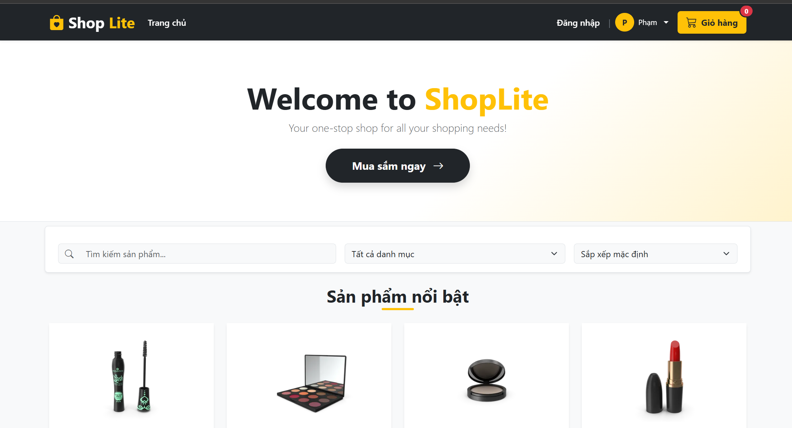

# Mô tả: 
ShopLite là một ứng dụng website bán hàng mini chạy hoàn toàn ở phía Client (Front-end). Dữ liệu sản phẩm sẽ được lấy về từ một API công khai. Dự án được xây dựng nhằm tối ưu hóa trải nghiệm mua sắm, đồng bộ giao diện và áp dụng các kỹ năng xử lý DOM, sự kiện (Event) cùng lưu trữ cục bộ (LocalStorage).

Link github: https://github.com/phamhongle412004-bit/FEF_ASSIGNMENTS_LePH1

# Ảnh chụp giao diện dự án

* **Trang chủ:**

